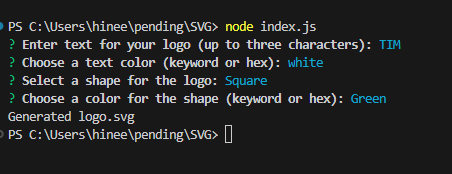

SVG-Logo-Maker

Create simple SVG logos quickly from the command line.

License: MIT

Description
SVG-Logo-Maker allows users to generate SVG logos via a series of command-line prompts. Choose the text, color, and shape to create a unique logo saved as an SVG file. Additionally, the project includes unit testing for functionality verification

Certainly! Here's a shorter version of the README with the author's name changed to "Neeraja Narayanan" and the GitHub repo updated:

SVG-Logo-Maker
Create simple SVG logos quickly from the command line.

License: MIT

Description
SVG-Logo-Maker allows users to generate SVG logos via a series of command-line prompts. Choose the text, color, and shape to create a unique logo saved as an SVG file. Additionally, the project includes unit testing for functionality verification.

Technologies
Node.js v16
Inquirer v8.2.4

Installation & Usage
Clone the repo.
Navigate to the directory and run npm install.
Use node index.js to start the application and follow the prompts.

Contact
Neeraja Narayanan
https://github.com/hineeraja/SVG-logo-generator
hineeraja@gmail.com
https://drive.google.com/file/d/1rjPek_SQiwbMYrCoK1gozadiXVzR8aUL/view

Screenshots

